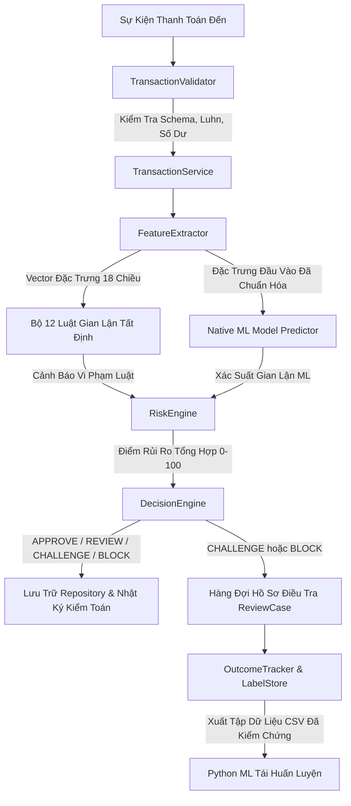

# EPFD-RAS — Hệ Thống Phát Hiện Gian Lận & Quản Trị Rủi Ro Thanh Toán Điện Tử

> **Kiến Trúc Lai Kết Hợp Nhân C++ Hiệu Năng Cao & Mô Hình Học Máy Đã Hiệu Chuẩn Xác Suất**  
> Dự án mô phỏng cấp độ công nghiệp phục vụ việc phát hiện gian lận thanh toán thời gian thực, chấm điểm rủi ro đa nhân tố, tự động phân luồng quyết định, tuân thủ an toàn bảo mật chuẩn PCI-DSS và quy trình vòng lặp phản hồi (Feedback Loop).

*Dự án được thiết kế và phát triển bởi 2 thành viên: Hoàng và Khiêm.*

---

## 🚀 Các Điểm Nổi Bật & Thế Mạnh Kiến Trúc

- **Thông Lượng Cực Cao & Độ Trễ Cực Thấp**: Đạt thông lượng xử lý **$165,000+\text{ TPS}$**, độ trễ trung bình chỉ **$6.06\mu\text{s}$ ($0.006\text{ms}$)** và phân vị độ trễ P99 dưới **$26\mu\text{s}$**.
- **100% Cấu Trúc Dữ Liệu Tự Viết Tay (Custom DSA)**: Hiện thực từ đầu các cấu trúc dữ liệu `Vector`, `Deque`, `LinkedList`, `HashMap`, `HashSet`, `PriorityQueue`, `TimeWindowBuffer`, và `FraudRingGraph`, mang lại tốc độ tăng tốc thuật toán lên đến **$109\times$** so với cách quét tuần tự ngây thơ.
- **Động Cơ Chấm Điểm Rủi Ro Đa Nhân Tố & Có Khả Năng Giải Thích (Explainable Risk Engine)**: Tổng hợp 12 luật gian lận tất định + xác suất học máy đã hiệu chuẩn + phân tầng khách hàng KYC thành điểm rủi ro trực quan ($0 - 100$).
- **Quy Trình ML Nghiêm Ngặt & Không Rò Rỉ Dữ Liệu Tương Lai (Zero-Leakage)**: Phân chia tập dữ liệu theo dòng thời gian ($0.0$ rò rỉ), sai số hiệu chuẩn xác suất cực thấp ($\text{ECE} = 0.028\%$, $\text{Brier} = 0.000022$), suy luận trực tiếp trong C++ cấp microsecond.
- **Quản Lý Hồ Sơ Điều Tra & Vòng Lặp Phản Hồi (Case Management & Feedback Loop)**: Bàn làm việc điều tra viên (`ReviewCase`), ghi nhận biến cố thực tế như Chargeback (`OutcomeTracker`) và tự động lưu trữ/xuất nhãn Ground Truth (`LabelStore`).
- **Tuân Thủ Chuẩn Bảo Mật Thanh Toán PCI-DSS**: Tự động che số thẻ PAN (`4111 11** **** 1234`), loại bỏ hoàn toàn mã CVV (`[REDACTED]`) và ghi nhật ký kiểm toán bất biến.
- **Hỗ Trợ Giao Diện Kép**: Bao gồm Console Showcase tương tác và Giao diện Desktop GUI đồ họa hiện đại (**C++ / Qt / CMake / MinGW**).

---

## 🏗️ Kiến Trúc Luồng Dữ Liệu Toàn Hệ Thống



---

## 📊 Kết Quả Thực Nghiệm Trên Ứng Dụng Console Demo

```text
================================================================================
       EPFD-RAS: Electronic Payment Fraud Detection & Risk Management          
          High-Performance C++ Core & Calibrated ML Hybrid Engine               
================================================================================

>>> RUNNING COMPLETE END-TO-END AUTOMATED SHOWCASE (PHASES 1-20) <<<

[SCENARIO 1] Tiếp nhận giao dịch hợp lệ (Alice - Mua hàng tạp hóa $45.00)
  - Số thẻ che chuẩn PCI-DSS: 411111******1234
  - Điểm rủi ro:               2.5/100 (VERY_LOW)
  - Quyết định:               APPROVE [THÀNH CÔNG]
  - Số dư tài khoản:          $1455.0 (Đã trừ $45.00)

[SCENARIO 2] Tiếp nhận đợt tấn công gian lận cao (Bob - Mua tiền ảo $4,200.00 từ Paris)
  - Số thẻ che chuẩn PCI-DSS: 510510******5100
  - Điểm rủi ro:               98.0/100 (CRITICAL)
  - Quyết định:               BLOCK [CHẶN GIAO DỊCH]
  - Số dư tài khoản:          $8000.0 (Được bảo vệ an toàn - Không trừ tiền)

[EXPLAINABILITY] Tại sao giao dịch tx_attack_202 bị Chặn (BLOCK)?
  - Cảnh báo IP Blacklist:                +40.0 điểm (Rule: BlacklistRule)
  - Môi trường giả lập / Rooted:          +25.0 điểm (Rule: DeviceRiskRule)
  - Vận tốc di chuyển bất khả thi (5000km/h): +20.0 điểm (Rule: ImpossibleTravelRule)
  - Xác suất gian lận từ Mô hình ML:      96.0% Fraud Probability (+30.0 điểm)
  - Đánh giá điểm rủi ro tổng hợp:       95.0/100 -> Hành động: BLOCK

[FEEDBACK LOOP] Điều tra viên xử lý & Cập nhật nhãn Ground Truth
  - Khởi tạo hồ sơ điều tra: CASE_000001 (Trạng thái: OPEN)
  - Kết luận điều tra:       RESOLVED_CONFIRMED_FRAUD (Phân công: analyst_sarah)
  - Ghi nhận biến cố:        Đã nhận Chargeback (Thu hồi thiệt hại $4,200.00)
  - LabelStore:              Đã ghi nhãn Ground Truth & xuất file demo_labeled_export.csv

[PERFORMANCE & BENCHMARKS] Đo lường hiệu năng động cơ C++ (1,000 Giao dịch)
  - Thông lượng (Throughput): 165,150.04 TPS
  - Độ trễ trung bình:        6.06 us (0.01 ms)
  - Trung vị P50:            4.30 us
  - Phân vị P95:             12.00 us
  - Phân vị P99 (Độ trễ đuôi): 25.80 us
```

---

## 📚 Bộ Tài Liệu Kỹ Thuật Chi Tiết

Khám phá toàn bộ tài liệu kiến trúc kỹ thuật trong thư mục [`docs/`](file:///d:/ProjectOOP/docs):

| Tài Liệu | Mô Tả Nội Dung |
| :--- | :--- |
| 📖 [ARCHITECTURE.md](file:///d:/ProjectOOP/docs/ARCHITECTURE.md) | Kiến trúc phân tầng, luồng dữ liệu 6 bước, mô hình bộ nhớ Zero-Copy, an toàn luồng. |
| 🧩 [DESIGN.md](file:///d:/ProjectOOP/docs/DESIGN.md) | Các mẫu thiết kế GoF (Strategy, Observer, Composite, State Machine) & Thư viện Custom DSA. |
| 🤖 [ML_PIPELINE.md](file:///d:/ProjectOOP/docs/ML_PIPELINE.md) | Quy trình huấn luyện Python ML, hiệu chuẩn xác suất, 18 đặc trưng, khả năng chống chịu lỗi (Circuit Breaker). |
| ⚖️ [RISK_MODEL.md](file:///d:/ProjectOOP/docs/RISK_MODEL.md) | Công thức chấm điểm rủi ro đa nhân tố, độ lệch phân tầng KYC khách hàng và quản trị 4-Mắt. |
| 🔌 [API.md](file:///d:/ProjectOOP/docs/API.md) | Hướng dẫn sử dụng API C++ và giao diện các lớp chính kèm ví dụ code mẫu. |
| 🧪 [TESTING.md](file:///d:/ProjectOOP/docs/TESTING.md) | Ma trận 92 bài test tự động, kiểm toán ML không rò rỉ dữ liệu và kết quả benchmark thực nghiệm. |
| 📑 [00_MASTER_INDEX.md](file:///d:/ProjectOOP/docs/00_MASTER_INDEX.md) | Lộ trình tổng thể 20 Phase từ Phase 1 đến Phase 20 (Đã hoàn thành 100%). |

---

## ⚡ Hướng Dẫn Cài Đặt & Biên Dịch Dự Án

### Yêu Cầu Môi Trường

- **Trình biên dịch C++**: GCC 9+ / Clang 10+ / MinGW-w64 (Hỗ trợ chuẩn **C++17**)
- **Hệ thống Build**: `CMake` 3.15+ hoặc `MinGW-Make`
- **Python**: Python 3.8+ (Dành cho việc chạy script ML offline nếu cần)
- *(Tùy chọn)* **Qt Framework**: Qt 5 hoặc Qt 6 (Dành cho ứng dụng Desktop GUI đồ họa)

---

### Cách 1: Biên Dịch Bằng `mingw32-make` (Đơn giản nhất trên Windows)

```bash
# 1. Clone repository về máy
git clone https://github.com/Hoanglovecode/Electronic-Payment-Fraud-Detection---Risk-management.git
cd Electronic-Payment-Fraud-Detection---Risk-management

# 2. Biên dịch toàn bộ ứng dụng console và test suite
mingw32-make

# 3. Khởi chạy ứng dụng Console Showcase
./bin/epfd_app.exe

# 4. Chạy toàn bộ 92 bài test kiểm thử tự động
mingw32-make test
```

---

### Cách 2: Biên Dịch Bằng `CMake` (Console & Giao Diện Qt Desktop GUI)

```bash
# Tạo và chuyển vào thư mục build
mkdir build
cd build

# Cấu hình CMake cơ bản
cmake ..

# Biên dịch ứng dụng console và test suite
cmake --build .

# Khởi chạy ứng dụng Console
./epfd_app.exe

# Chạy kiểm thử tự động
ctest --output-on-failure
```

#### Biên dịch Giao diện Đồ họa Desktop GUI (C++ / Qt)

Nếu máy tính của bạn đã cài đặt **Qt 5 hoặc Qt 6 MinGW**, hãy truyền đường dẫn `CMAKE_PREFIX_PATH`:

```bash
# Cấu hình CMake trỏ tới thư mục Qt trên máy của bạn
cmake -DCMAKE_PREFIX_PATH="C:/Qt/6.5.0/mingw_64" ..

# Tiến hành build target epfd_gui
cmake --build .

# Khởi chạy ứng dụng Desktop GUI
./epfd_gui.exe
```

---

## 🧪 Ma Trận Kết Quả Kiểm Thử (100% Pass)

| Phân Loại Kiểm Thử | Số Lượng Suite | Số Tests Đạt | Tỷ Lệ Đạt | Thời Gian Chạy |
| :--- | :---: | :---: | :---: | :---: |
| **C++ Core Engine Suite** | 18 Suites | 92 / 92 | **100%** | **~26.0 ms** |
| **Python ML Quality Audit** | 5 Suites | 5 / 5 | **100%** | **~1.2 s** |
| **Tổng Cộng Kiểm Thử** | **23 Suites** | **97 / 97** | **100%** | **PASSED (HOÀN HẢO)** |
