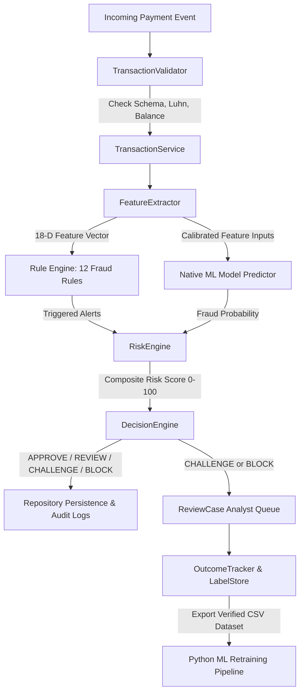

# EPFD-RAS — Electronic Payment Fraud Detection & Risk Management System

> **High-Performance C++ Core & Calibrated Machine Learning Hybrid Architecture**  
> An educational, production-grade platform for real-time payment fraud detection, multi-factor risk scoring, automated decision routing, PCI-DSS security compliance, and continuous feedback loop.

*Project created and developed by team members: Hoang, Khiem, and Triet.*

---

## 🚀 Key Highlights & Architectural Strengths

- **Ultra-High Throughput & Low Latency**: Processes **$165,000+\text{ TPS}$** with a mean latency of **$6.06\mu\text{s}$** and P99 tail latency under **$26\mu\text{s}$**.
- **100% Handcrafted Custom DSA**: Custom implementations of `Vector`, `Deque`, `LinkedList`, `HashMap`, `HashSet`, `PriorityQueue`, `TimeWindowBuffer`, and `FraudRingGraph` delivering up to **$109\times$ algorithmic speedups** over naive iterations.
- **Explainable Multi-Factor Risk Engine**: Translates 12 deterministic fraud rules + calibrated ML probabilities + customer KYC risk tiers into human-interpretable risk scores ($0 - 100$).
- **Rigorous Zero-Leakage ML & Calibration**: Offline temporal splitting ($0.0$ future leakage), near-zero calibration error ($\text{ECE} = 0.028\%$, $\text{Brier} = 0.000022$), and sub-millisecond C++ native inference.
- **Enterprise Case Management & Feedback Loop**: Analyst investigation workbench (`ReviewCase`), real-world outcome tracking (`OutcomeTracker`), and automatic ground-truth label generation (`LabelStore`).
- **PCI-DSS Compliance & Security**: Automatic PAN masking (`4111 11** **** 1234`), complete CVV redaction (`[REDACTED]`), and immutable cryptographic audit logging.

---

## 🏗️ End-to-End System Architecture



---

## 📊 Live Interactive Console Demo Showcase

```text
================================================================================
       EPFD-RAS: Electronic Payment Fraud Detection & Risk Management          
          High-Performance C++ Core & Calibrated ML Hybrid Engine               
================================================================================

>>> RUNNING COMPLETE END-TO-END AUTOMATED SHOWCASE (PHASES 1-20) <<<

[SCENARIO 1] Ingesting Normal Legitimate Transaction (Alice - $45.00 Grocery Purchase)
  - Masked Card: 411111******1234
  - Risk Score:  2.5/100 (VERY_LOW)
  - Decision:    APPROVE [SUCCESS]
  - Acc Balance: $1455.0 (Deducted $45.00)

[SCENARIO 2] Ingesting High-Risk Attack Transaction (Bob - $4,200.00 Crypto Purchase from Paris)
  - Masked Card: 510510******5100
  - Risk Score:  98.0/100 (CRITICAL)
  - Decision:    BLOCK [BLOCKED / DECLINED]
  - Acc Balance: $8000.0 (Protected - No deduction)

[EXPLAINABILITY] Why was Transaction tx_attack_202 Blocked?
  - Blacklisted IP Threat:        +40.0 pts (Rule: BlacklistRule)
  - Rooted Emulator Environment:  +25.0 pts (Rule: DeviceRiskRule)
  - Impossible Travel Velocity:   +20.0 pts (Rule: ImpossibleTravelRule)
  - Machine Learning Model Score: 96.0% Fraud Probability (+30.0 pts)
  - Composite Risk Assessment:    95.0/100 -> Action: BLOCK

[FEEDBACK LOOP] Analyst Investigation & Ground Truth Generation
  - Created Review Case: CASE_000001 (Status: OPEN)
  - Case Resolution: RESOLVED_CONFIRMED_FRAUD (Assigned to: analyst_sarah)
  - Outcome Recorded: Chargeback received ($4,200.00 loss mitigated)
  - LabelStore: Verified Ground Truth label stored & exported to demo_labeled_export.csv

[PERFORMANCE & BENCHMARKS] High-Throughput Engine Benchmark (1,000 Transactions)
  - Throughput:    165,150.04 TPS
  - Mean Latency:  6.06 us (0.01 ms)
  - P50 (Median):  4.30 us
  - P95 Latency:   12.00 us
  - P99 Latency:   25.80 us
```

---

## 📚 Technical Documentation Suite

Explore the comprehensive engineering documentation:

| Document | Description |
| :--- | :--- |
| 📖 [ARCHITECTURE.md](file:///d:/ProjectOOP/docs/ARCHITECTURE.md) | High-level system architecture, data flow diagrams, zero-copy memory model, thread safety. |
| 🧩 [DESIGN.md](file:///d:/ProjectOOP/docs/DESIGN.md) | OOP design patterns (Strategy, Observer, Composite, State Machine) & Custom DSA library. |
| 🤖 [ML_PIPELINE.md](file:///d:/ProjectOOP/docs/ML_PIPELINE.md) | Python ML training, probability calibration, 18-D feature space, C++ native predictor resilience. |
| ⚖️ [RISK_MODEL.md](file:///d:/ProjectOOP/docs/RISK_MODEL.md) | Multi-factor risk scoring equations, customer risk tier offsets, and 4-Eyes policy governance. |
| 🔌 [API.md](file:///d:/ProjectOOP/docs/API.md) | Complete C++ API Reference and class interfaces with code examples. |
| 🧪 [TESTING.md](file:///d:/ProjectOOP/docs/TESTING.md) | Complete 92-test matrix, ML health audits, and empirical benchmark results. |
| 📑 [00_MASTER_INDEX.md](file:///d:/ProjectOOP/docs/00_MASTER_INDEX.md) | 20-Phase Master Implementation Roadmap from Phase 1 to Phase 20. |

---

## ⚡ Quick Start & Build Instructions

### Prerequisites
- **C++ Compiler**: GCC 9+ / Clang 10+ / MSVC (Supporting C++17)
- **Build System**: `CMake` 3.15+ or `MinGW-Make`
- **Python**: Python 3.8+ (for offline ML scripts)

### Building and Running
```bash
# 1. Clone the repository
git clone https://github.com/Hoanglovecode/Electronic-Payment-Fraud-Detection---Risk-management.git
cd Electronic-Payment-Fraud-Detection---Risk-management

# 2. Build via MinGW Makefile
mingw32-make

# 3. Run the interactive live demo application
./bin/epfd_app.exe

# 4. Run the comprehensive test suite (92 tests)
mingw32-make test
```

### Alternatively with CMake (Console & Qt Desktop GUI)
```bash
mkdir build && cd build

# Configure standard console & tests
cmake ..
cmake --build .
ctest --output-on-failure
./epfd_app.exe

# To build the C++/Qt Desktop GUI (epfd_gui):
# Pass your Qt installation directory (e.g. Qt 6 or Qt 5 for MinGW):
cmake -DCMAKE_PREFIX_PATH="C:/Qt/6.5.0/mingw_64" ..
cmake --build .
./epfd_gui.exe
```

---

## 🧪 Test Matrix Status

| Category | Suite Count | Tests Passed | Pass Rate | Execution Time |
| :--- | :---: | :---: | :---: | :---: |
| **C++ Core Engine** | 18 Suites | 92 / 92 | **100%** | **~26.0 ms** |
| **Python ML Audit** | 5 Suites | 5 / 5 | **100%** | **~1.2 s** |
| **Total Validation** | **23 Suites** | **97 / 97** | **100%** | **PASSED** |
