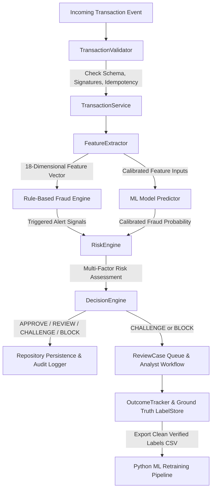

# EPFD-RAS System Architecture Specification

## 1. High-Level Architecture Overview

EPFD-RAS (Electronic Payment Fraud Detection & Risk Management System) is an enterprise-grade hybrid platform designed with a high-performance C++ core runtime engine and an offline Python machine learning training & calibration pipeline.



---

## 2. Core Modules Breakdown

| Module Layer | Primary C++ Components | Key Responsibilities |
| :--- | :--- | :--- |
| **Domain Models** | `Transaction`, `Customer`, `Account`, `PaymentMethod`, `Device`, `Location`, `FraudAlert`, `RiskAssessment`, `Dispute` | Encapsulates immutable domain entities, validation invariants, Luhn checks, and Haversine distance computations. |
| **Custom DSA Layer** | `Vector`, `Deque`, `LinkedList`, `HashMap`, `HashSet`, `PriorityQueue`, `Queue`, `TimeWindowBuffer`, `FraudRingGraph`, `FastLookupIndex` | Custom high-performance data structures built from scratch without standard containers for core algorithmic paths. |
| **Validation Layer** | `TransactionValidator`, `TransactionService` | Atomic balance adjustments, duplicate idempotency checks, currency conformity, account status enforcement. |
| **Feature Layer** | `FeatureExtractor`, `TransactionFeatures` | Computes sliding-window velocity, impossible travel speed, IP/device diversity, and merchant risk features with zero temporal leakage. |
| **Rule Engine Layer** | `FraudDetectorEngine`, `ConcreteFraudRules`, `AdvancedFraudRules` | Evaluates 12 deterministic rules (Velocity, Impossible Travel, Blacklist, Card Testing, Mule Smurfing, ATO). |
| **ML Runtime Layer** | `IModelPredictor`, `NativeMLModelPredictor`, `MLResilienceManager`, `MLModelRegistry` | Native C++ decision tree inference, hot-swappable model versions, fail-open/fail-closed circuit breaking. |
| **Risk Engine Layer** | `RiskEngine`, `RiskAggregator`, `CustomerRiskTierManager`, `PolicyChangeAuditManager` | Weighted multi-factor risk aggregation ($0-100$), adaptive customer risk tiers, 4-Eyes policy governance. |
| **Decision Layer** | `DecisionEngine`, `StandardDecisionPolicy`, `StrictDecisionPolicy`, `FrictionlessPolicy` | Maps risk scores to deterministic business actions (`APPROVE`, `REVIEW`, `CHALLENGE_3DS`, `BLOCK`). |
| **Feedback Loop** | `ReviewCase`, `CaseManager`, `OutcomeTracker`, `LabelStore` | Human-in-the-loop analyst investigations, chargeback tracking, ground-truth label storage, retraining dataset CSV export. |
| **Security & Utilities** | `SecurityUtils`, `TransactionSimulator`, `BenchmarkTimer` | PCI-DSS PAN masking, CVV redaction, synthetic fraud stream generator, microsecond latency percentile benchmarks. |

---

## 3. Data Flow & Transaction Lifecycle

```text
1. Transaction Arrival (Ingestion)
   └── Validated for required fields, Luhn card validity, account balance, and duplicate idempotency.

2. Feature Extraction (Zero-Leakage Guard)
   └── In-memory sliding window deque queries customer history strictly up to t_current - epsilon.

3. Parallel Rule & ML Evaluation
   ├── Rule Engine triggers deterministic fraud rules (Blacklist, Impossible Travel, Card Testing).
   └── ML Predictor evaluates calibrated probability P(Fraud | Features) via decision tree logic.

4. Multi-Factor Risk Aggregation
   └── Score = w_rule * (RuleScore) + w_ml * (MLScore) + w_cust * (CustomerTierOffset).

5. Policy Decision & Action Routing
   ├── Score < 30   ──> APPROVE (Deduct balance, complete order)
   ├── 30 <= S < 60 ──> REVIEW  (Allow conditional processing, flag for offline audit)
   ├── 60 <= S < 80 ──> CHALLENGE_3DS (Require Step-up MFA / OTP verification)
   └── Score >= 80  ──> BLOCK   (Decline transaction, protect balance, open ReviewCase)

6. Post-Decision Feedback & Audit
   ├── Event logged to PCI-DSS compliant audit log with masked PAN and redacted CVV.
   └── Analyst resolves case -> GroundTruthRecord written to LabelStore -> Exported to CSV.
```

---

## 4. Concurrency & Memory Model

- **Thread-Safety**: In-memory repositories, `FastLookupIndex`, and `OutcomeTracker` utilize granular `std::mutex` and `std::lock_guard` RAII locks, avoiding global contention.
- **Zero-Copy Optimization**: Feature vectors (`TransactionFeatures`) and raw double arrays are passed by reference and move semantics throughout the pipeline.
- **Cache-Friendly Design**: Contiguous dynamic arrays in `Vector` and flat bucket arrays in `HashMap` maximize CPU cache locality.
